# System Zarządzania Serwisem Elektroniki - ElectroService

Kompleksowa aplikacja webowa przeznaczona do zarządzania profesjonalnym serwisem sprzętu elektronicznego, ze szczególnym uwzględnieniem marki Apple. System automatyzuje proces od przyjęcia urządzenia, przez diagnostykę i logistykę części, aż po kontrolę jakości i wydanie sprzętu klientowi.

**Jaki problem rozwiązuje?**
W małych i średnich serwisach komunikacja między biurem (recepcją), technikami a magazynem często kuleje. ElectroService eliminuje ten problem, wprowadzając sztywne reguły workflow, automatyczne powiadomienia o statusach oraz dynamiczne zarządzanie terminami, co pozwala uniknąć przestojów i przepełnienia warsztatu.

**Czym się wyróżnia?**
- **Dedykowany sprzętowi Apple:** Predefiniowany katalog modeli i części dedykowany urządzeniom Apple.
- **Automatyczne wiązanie części z konkretnym zleceniem:** Automatyczne powiązanie zapotrzebowania na części z konkretnym zleceniem i modelem.
- **Zabezpieczenia procesu:** Mechanizmy blokujące (np. limit aktywnych zleceń na technika, blokada wydania bez części).
- **Wycofywanie zleceń:** Zaawansowana obsługa odrzucenia kosztów przez klienta, przywracająca zlecenie do poprawki z najwyższym priorytetem.

---

## Uruchomienie projektu (developer)

### Użyte technologie

| Technologia | Wersja | Link |
|---|---|---|
| PHP | ^8.3 | https://www.php.net |
| Laravel | ^13.8 | https://laravel.com |
| SQLite / MySQL | 3.0+ / 8.0+ | https://www.sqlite.org |
| Composer | 2.x | https://getcomposer.org |
| Bootstrap | 5.3 | https://getbootstrap.com |
| FullCalendar | 6.x | https://fullcalendar.io |

### Wymagania programowe

- **System operacyjny:** Windows 10/11, macOS lub Linux.
- **PHP ^8.3** z rozszerzeniami: `pdo_sqlite`, `mbstring`, `openssl`, `curl`.
- **Composer 2** - menedżer zależności PHP.
- **SQLite** (domyślnie skonfigurowane w `database.sqlite`).

### Proces instalacji

**1. Sklonuj repozytorium**
```bash
git clone https://github.com/P0z528/ProjektSerwis.git
cd ProjektSerwis
```

**2. Zainstaluj zależności**
```bash
composer install
```

### Proces konfiguracji

**1. Zmienne środowiskowe**
Skopiuj plik `.env.example` jako `.env`. Domyślna konfiguracja używa bazy SQLite.
```bash
cp .env.example .env
php artisan key:generate
```

**2. Baza danych**
Utwórz pusty plik bazy danych (jeśli używasz SQLite) i wykonaj migracje wraz z danymi początkowymi.

Windows (PowerShell):
```powershell
New-Item database/database.sqlite -ItemType File
php artisan migrate --seed
```

macOS / Linux:
```bash
touch database/database.sqlite
php artisan migrate --seed
```

**3. Dowiązanie magazynu plików (zdjęcia)**
Utwórz dowiązanie katalogu `storage`, aby wgrywane zdjecia były widoczne w aplikacji:
```bash
php artisan storage:link
```

**4. Uruchomienie serwera**
```bash
php artisan serve
```
Aplikacja będzie dostępna pod adresem: **http://localhost:8000**

---

**5. Dane logowania (Seed)**
System generuje domyślne konta dla każdej roli:
| Rola | Login | Hasło |
| :--- | :--- | :--- |
| **Administrator** | `admin` | `admin123` |
| **Recepcja** | `recepcja` | `rec123` |
| **Technik** | `technik1` | `tech123` |
| **Technik** | `technik2` | `tech123` |
| **Magazyn** | `magazyn` | `mag123` |

## Uruchomienie projektu (user)

ElectroService jest aplikacją webową typu SaaS. Użytkownik końcowy (pracownik serwisu) korzysta z niej za pomocą nowoczesnej przeglądarki internetowej (Chrome, Firefox, Edge, Safari).

**Wymagania sprzętowe:**
- Dowolny komputer/tablet z dostępem do internetu.
- Rekomendowana rozdzielczość ekranu: min. 1280x720 px (pełna responsywność).
- Przeglądarka z obsługą JavaScript i HTML5.

---

## Podręcznik użytkownika

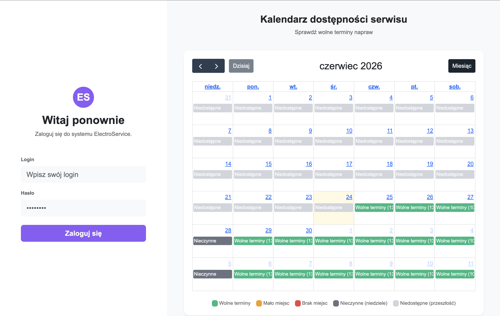
*Rysunek 1. Ekran powitalny systemu - formularz logowania zintegrowany z dynamicznym kalendarzem dostępności terminów (FullCalendar), który na bieżąco prezentuje obłożenie serwisu jeszcze przed zalogowaniem pracownika.*

### Role w systemie i moduły

| Rola | Odpowiedzialność | Kluczowe funkcje |
|---|---|---|
| **Administrator** | Zarządzanie zasobami ludzkimi i procesem | Zarządzanie pracownikami, edycja danych klientów i statusów, kontrola jakości, statystyki. |
| **Recepcja** | Kontakt z klientem i logistyka przyjęć | Dynamiczny kalendarz, tworzenie zleceń, wydruki potwierdzeń .txt, wydawanie sprzętu. |
| **Technik** | Serwis fizyczny urządzeń | Pobieranie zleceń , raportowanie napraw. |
| **Magazyn** | Gospodarka częściami | Obsługa zapotrzebowań, księgowanie dostaw, kontrola stanów magazynowych. |


### 1. Panel Administratora - Zarządzanie i Kontrola jakości
Administrator posiada najwyższe uprawnienia w systemie, czuwając nad poprawnością obiegu dokumentów.

- **Zarządzanie pracownikami:** Możliwość dodawania nowych kont, edycji danych istniejących pracowników oraz ich bezpiecznego usuwania.
- **Zarządzanie klientami:** Pełny wgląd w listę klientów i przypisanych do nich urządzeń. Admin może ręcznie korygować dane kontaktowe oraz wymuszać zmiany statusów zleceń w sytuacjach wyjątkowych.
- **Kontrola jakości:** Zatwierdzanie napraw ukończonych przez techników lub odsyłanie ich do poprawki z komentarzem.

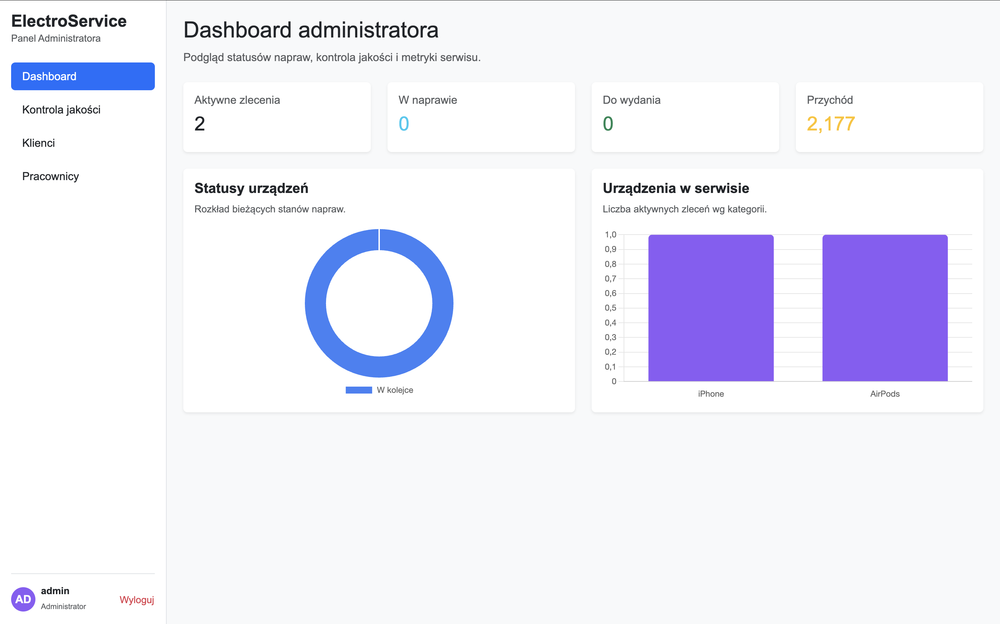
*Rysunek 2. Pulpit administratora - zbiorcze metryki serwisu (aktywne zlecenia, przychód, rozkład statusów napraw) prezentowane w formie kart z statystykami oraz wykresów, dające natychmiastowy obraz kondycji warsztatu.*

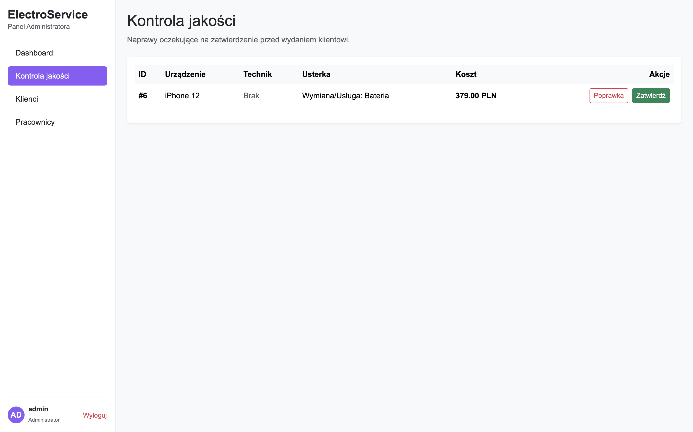
*Rysunek 3. Moduł kontroli jakości - lista napraw oczekujących na weryfikację, z opcją zatwierdzenia (status „Gotowe”) lub odesłania zlecenia do poprawki wraz z komentarzem dla technika.*

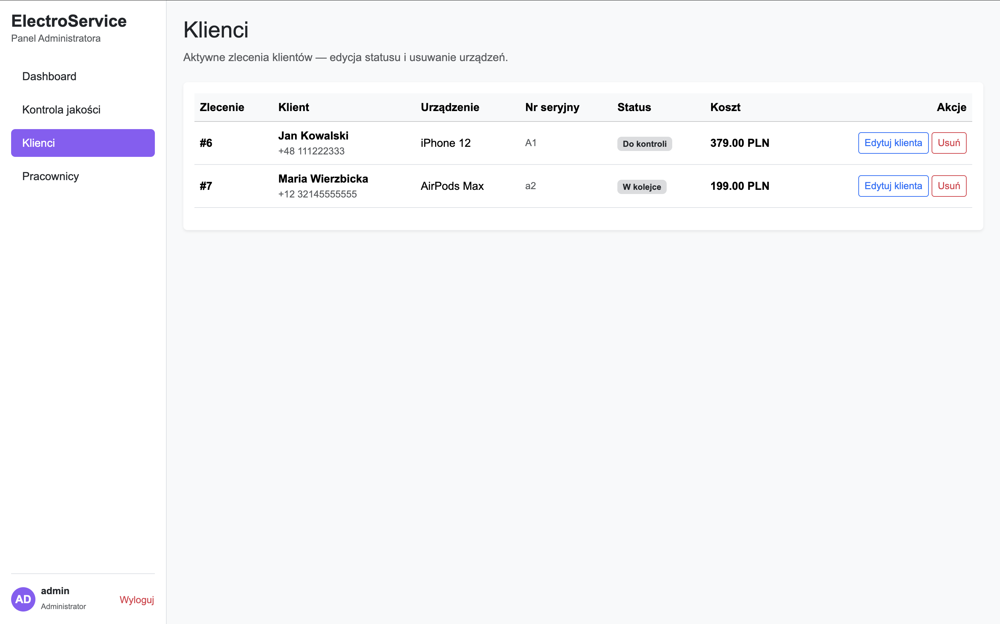
*Rysunek 4. Zarządzanie klientami - pełny wgląd w zlecenia klientów i przypisane urządzenia, z możliwością ręcznej korekty danych kontaktowych oraz wymuszenia zmiany statusu zlecenia.*

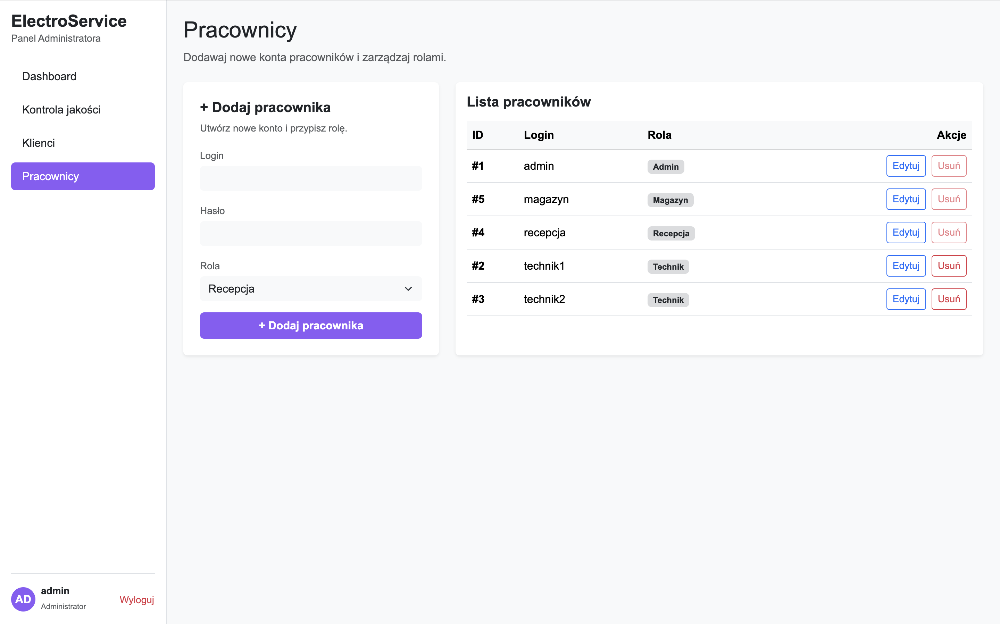
*Rysunek 5. Zarządzanie pracownikami - dodawanie, edycja i bezpieczne usuwanie kont z przypisaniem ról, z blokadą usunięcia ostatniej osoby pełniącej daną rolę w systemie.*

### 2. Panel Recepcji - Przyjęcie zlecenia
Głównym zadaniem recepcji jest sprawne wprowadzenie klienta do systemu.

- **Dynamiczny Kalendarz:** System automatycznie oblicza limity przyjęć:
  - Dni robocze: **13 urządzeń**.
  - Soboty: **10 urządzeń**.
  - Niedziele: **Nieczynne**.
- **Walidacja danych:** System normalizuje numery kierunkowe (domyślnie +48) i sprawdza poprawność numeru telefonu.
- **Katalog:** Wybór modelu automatycznie filtruje dostępne części i usługi w cenniku.
- **Potwierdzenie .txt:** Po zapisaniu zlecenia generowany jest dokument `Zlecenie_{ID}.txt` gotowy do wydruku dla klienta.

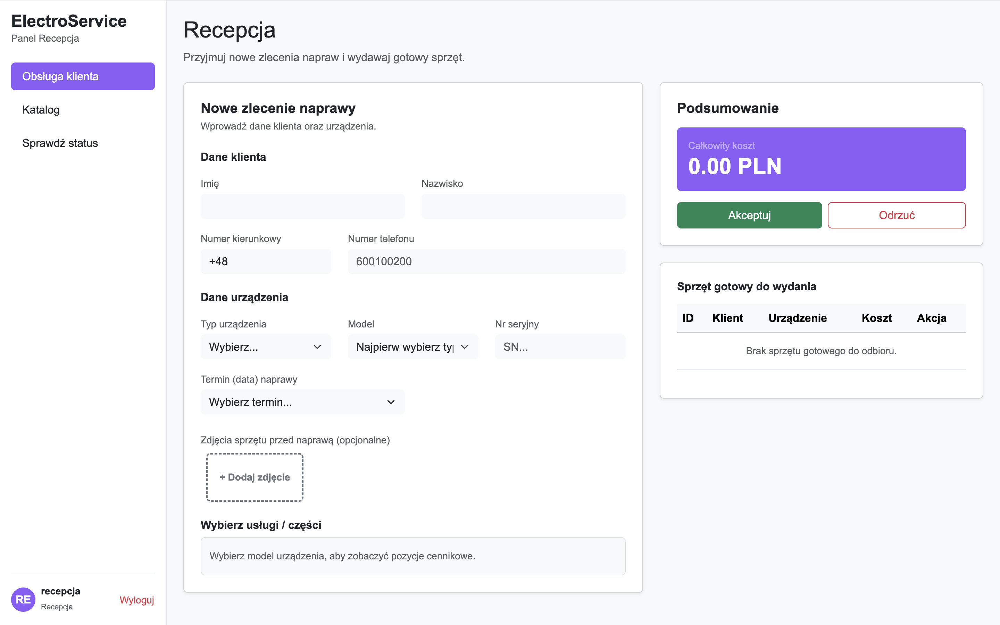
*Rysunek 6. Główny widok recepcji - formularz przyjęcia nowego zlecenia z danymi klienta, urządzenia i dokumentacją fotograficzną oraz panel wydawania gotowego sprzętu.*

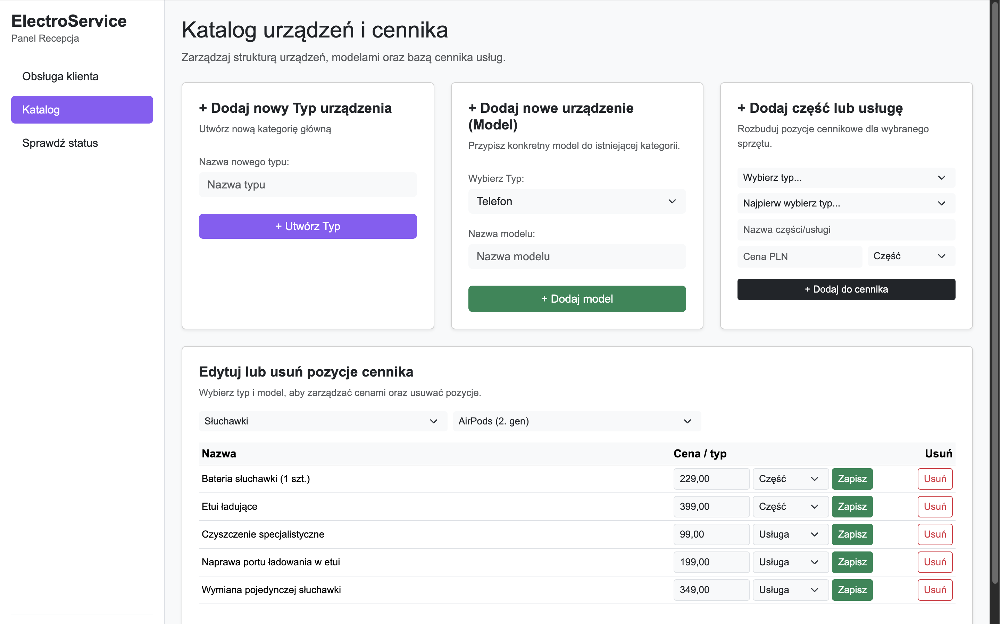
*Rysunek 7. Katalog urządzeń i cennika - zarządzanie strukturą typów, modeli oraz pozycji cennikowych; wybór modelu automatycznie filtruje dostępne części i usługi.*

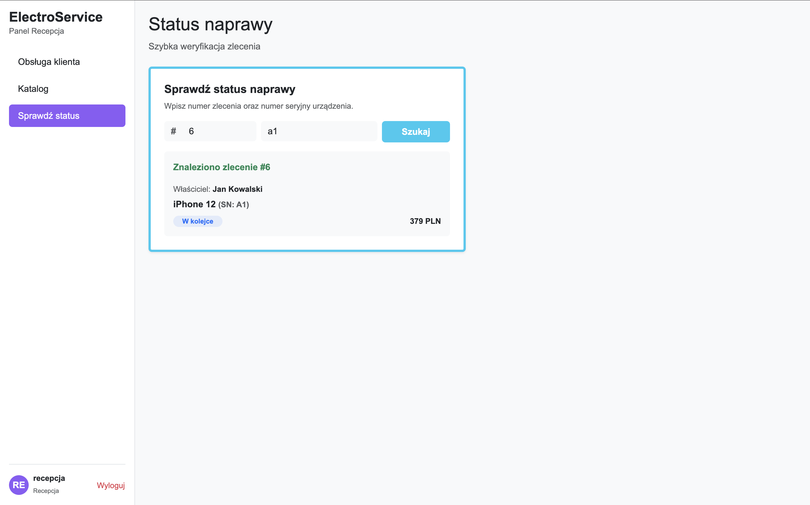
*Rysunek 8. Szybka weryfikacja statusu naprawy - wyszukiwanie zlecenia po numerze i numerze seryjnym urządzenia, umożliwiające bieżące informowanie klienta o postępie prac.*

### 3. Panel Technika - Warsztat
Technik operuje na "puli wspólnej" zleceń o statusie "W kolejce".

- **Limit obciążenia:** Jeden technik może mieć przypisane maksymalnie **4 aktywne zlecenia**. Próba wzięcia kolejnego skutkuje blokadą.
- **Sortowanie Priorytetowe:** Na górze listy zawsze pojawiają się zlecenia odrzucone przez kontrole jakości.
- **Zamawianie części:** Technik może zgłosić zapotrzebowanie na części z katalogu. Jeśli część nie była przewidziana przy przyjęciu, jej koszt jest automatycznie doliczany do zlecenia.
- **Blokada zamykania:** Nie można oznaczyć naprawy jako "Gotowa", dopóki magazyn nie wyda wszystkich zamówionych części.

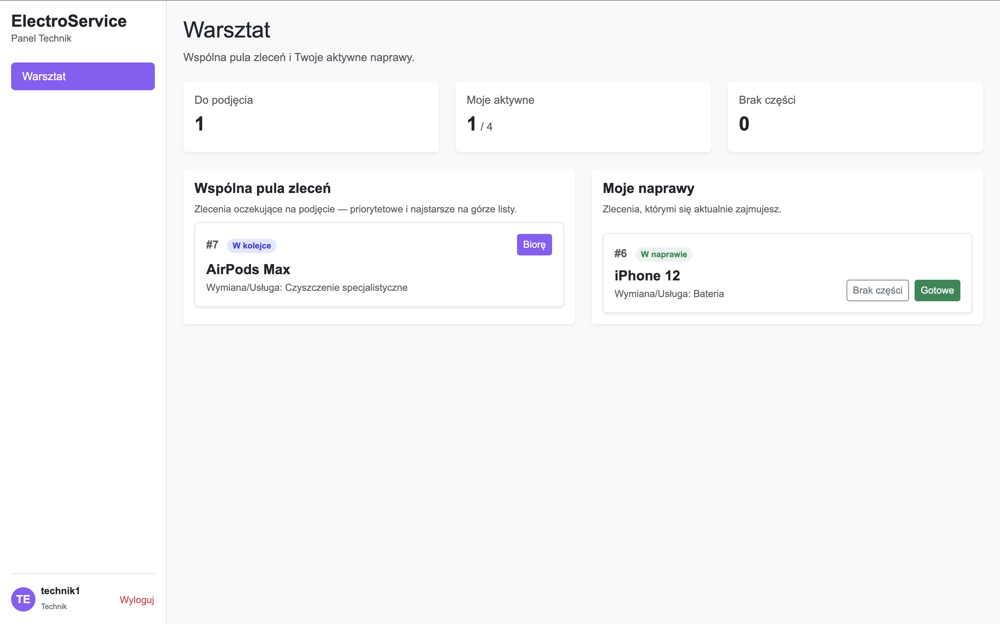
*Rysunek 9. Warsztat technika - wspólna pula zleceń oraz aktywne naprawy przypisane do zalogowanego pracownika, z możliwością zgłaszania zapotrzebowania na części i oznaczania zlecenia jako ukończonego.*

### 4. Panel Magazynu - Logistyka
Magazynier widzi listę zapotrzebowań zgłoszonych przez techników.

- **Statusy części:** `Oczekuje` (jest na stanie), `Do zamówienia` (brak na stanie), `Wydano`.
- **Księgowanie dostaw:** Jedno kliknięcie przenosi wszystkie pozycje z "Listy zakupów" na stan magazynowy, odblokowując możliwość wydania ich technikom.

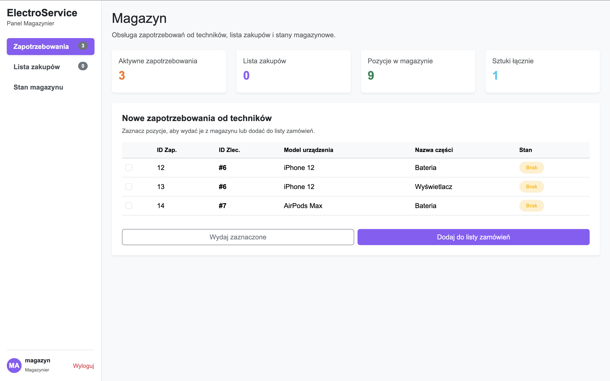
*Rysunek 10. Obsługa zapotrzebowań - lista części zgłoszonych przez techników z informacją o dostępności na stanie; magazynier wydaje pozycje dostępne lub kieruje brakujące do listy zakupów.*

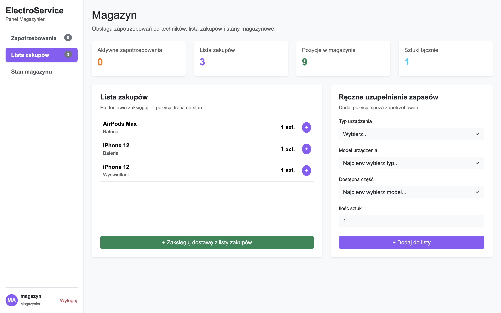
*Rysunek 11. Lista zakupów - zbiorcze zestawienie części do zamówienia u dostawcy oraz przycisk księgowania dostawy, który jednym kliknięciem przyjmuje pozycje na stan magazynowy.*

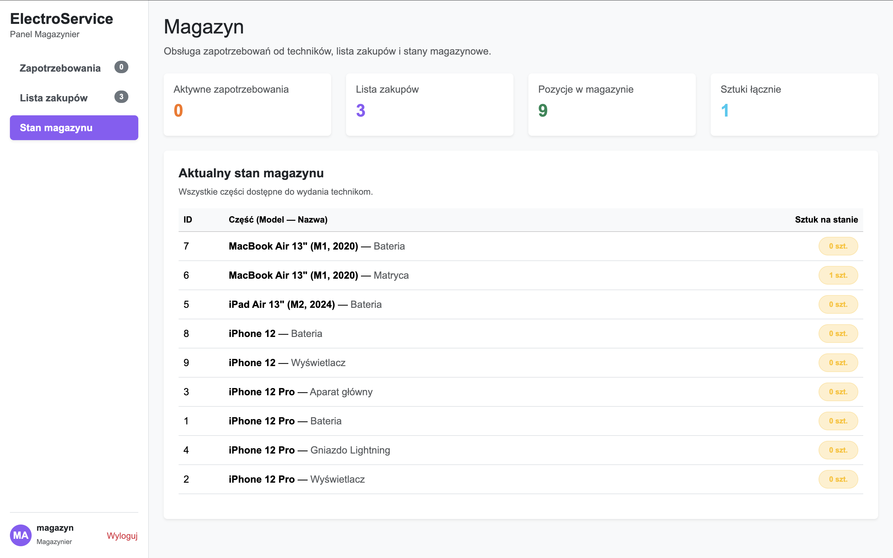
*Rysunek 12. Stan magazynu - aktualne ilości wszystkich części dostępnych do wydania technikom, z wizualnym oznaczeniem pozycji o niskim stanie.*

---

### Ścieżki użytkownika (User flow)

Pełny obieg urządzenia w systemie ElectroService:
1. **Przyjęcie (Recepcja):** Wprowadzenie danych klienta i urządzenia, wybór terminu w kalendarzu, wykonanie dokumentacji fotograficznej i wydruk potwierdzenia dla klienta.
2. **Diagnostyka i Naprawa (Technik):** Pobranie zlecenia z puli, analiza usterki. Jeśli potrzebne są dodatkowe elementy – zgłoszenie zapotrzebowania do magazynu.
3. **Obsługa części (Magazyn):** Weryfikacja stanu magazynowego. Jeśli części brak – dodanie do listy zakupów. Po dostawie – wydanie części technikowi.
4. **Zakończenie prac (Technik):** Po zamontowaniu części technik oznacza zlecenie jako ukończone.
5. **Kontrola jakości (Administrator):** Weryfikacja poprawności naprawy. Zatwierdzenie (status "Gotowe") lub odrzucenie (status "Poprawka").
6. **Wydanie (Recepcja):** Rozliczenie końcowe z klientem (akceptacja ewentualnych zmian kosztów) i zmiana statusu na "Wydane".

---

### Struktura bazy danych

Najważniejsze tabele systemu:

| Tabela | Opis |
|---|---|
| `Uzytkownicy` | Konta pracowników (login, rola, hash hasła). |
| `Klienci` | Dane kontaktowe zleceniodawców. |
| `Urzadzenia` | Informacje o sprzęcie (model, numer seryjny, przypisany klient). |
| `Zlecenia` | Centralna tabela workflow (statusy, koszty, daty naprawy, przypisany technik). |
| `ModeleApple` | Słownik typów i modeli urządzeń. |
| `CzesciKatalog` | Cennik usług i części przypisany do modeli. |
| `Czesci` | Aktualny stan magazynowy (ilości). |
| `Zapotrzebowania` | Historia i status zamówień części dla konkretnych zleceń. |
| `ZdjeciaZlecen` | Dokumentacja wizualna sprzętu. |

---

### Przypadki brzegowe i walidacja

System posiada szereg zabezpieczeń gwarantujących spójność danych:
- **Walidacja telefonu:** Przymusowe formatowanie numeru kierunkowego (np. +48) oraz weryfikacja długości numeru (9 cyfr dla Polski).
- **Bezpieczeństwo ról:** Blokada usunięcia ostatniego pracownika z danej roli (system zawsze musi mieć min. 1 Admina, 1 Technika itd.).
- **Ochrona Magazynu:** Zapobieganie powstawaniu duplikatów zapotrzebowań dla tego samego zlecenia.
- **Multimedia:** Front-endowa walidacja formatów zdjęć oraz ich automatyczna kompresja przed wysyłką (oszczędność miejsca na serwerze).
- **Ciągłość pracy:** Automatyczne przekazywanie zleceń do "Sierocej puli" w przypadku modyfikacji konta przypisanego technika.

---

### Responsywność i UI
Interfejs został zbudowany w oparciu o framework **Bootstrap 5**, co zapewnia pełną responsywność. Dzięki zastosowaniu klas takich jak `table-responsive`, wszystkie zestawienia danych, formularze oraz panele sterowania są czytelne zarówno na monitorach desktopowych, jak i na urządzeniach mobilnych (tablety, smartfony).

Poniższe zrzuty wykonano w rozdzielczości **1280x720 px**, dokumentując poprawne skalowanie poszczególnych modułów na mniejszych ekranach:

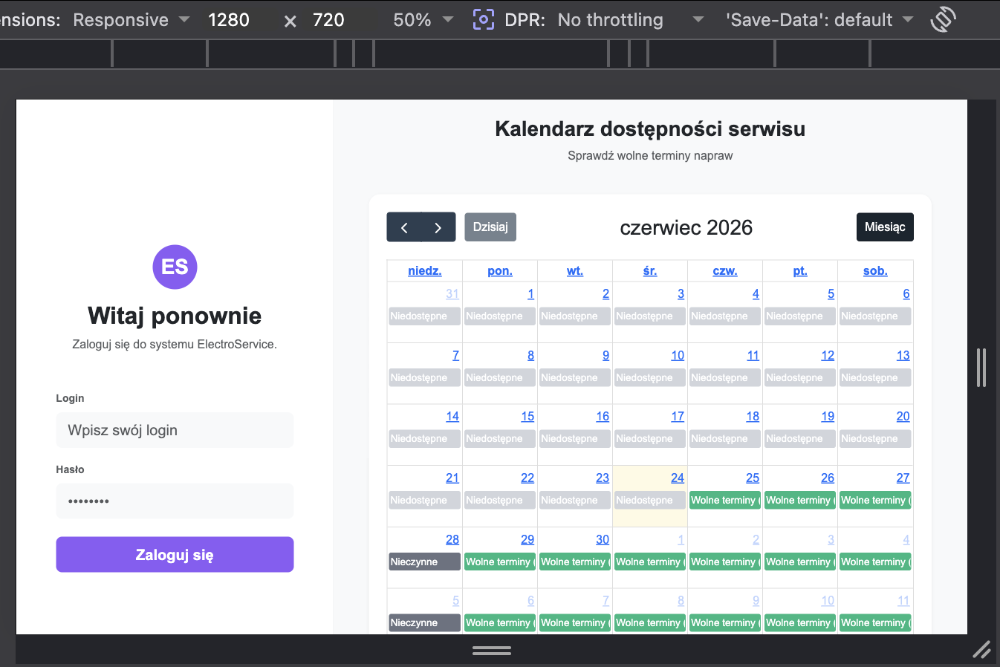
*Rysunek 13. Ekran logowania w rozdzielczości 1280x720 - formularz i kalendarz dostępności zachowują czytelność i proporcje na węższym ekranie.*

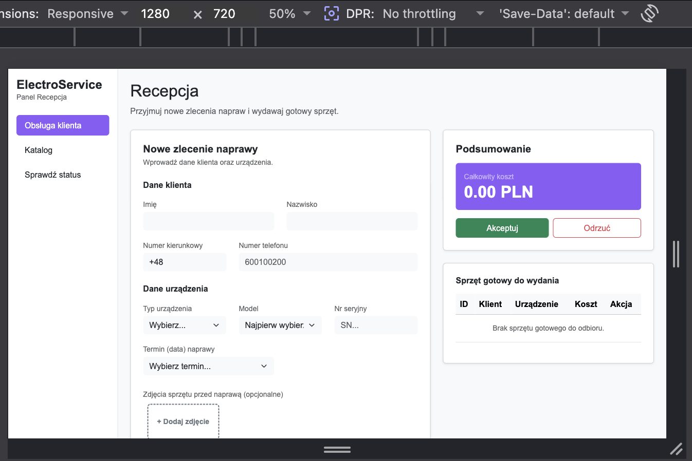
*Rysunek 14. Panel recepcji w widoku 1280x720 - formularz przyjęcia zlecenia i podsumowanie kosztów przestawiają się do układu kolumnowego bez utraty funkcjonalności.*

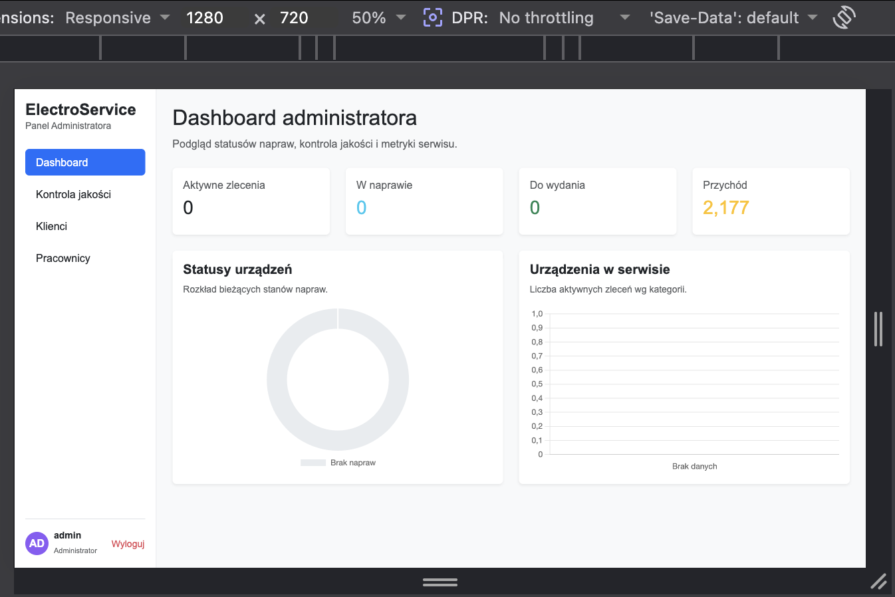
*Rysunek 15. Panel administratora w widoku 1280x720 - karty z statystykami oraz wykresy dostosowują rozmiar, a tabele korzystają z klasy `table-responsive` z poziomym przewijaniem.*

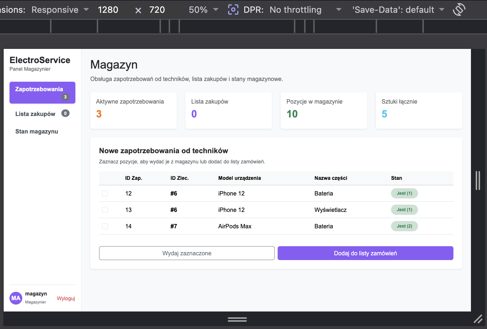
*Rysunek 16. Panel magazynu w widoku 1280x720 - zestawienia zapotrzebowań i stanów magazynowych pozostają w pełni obsługiwalne na mniejszym ekranie.*

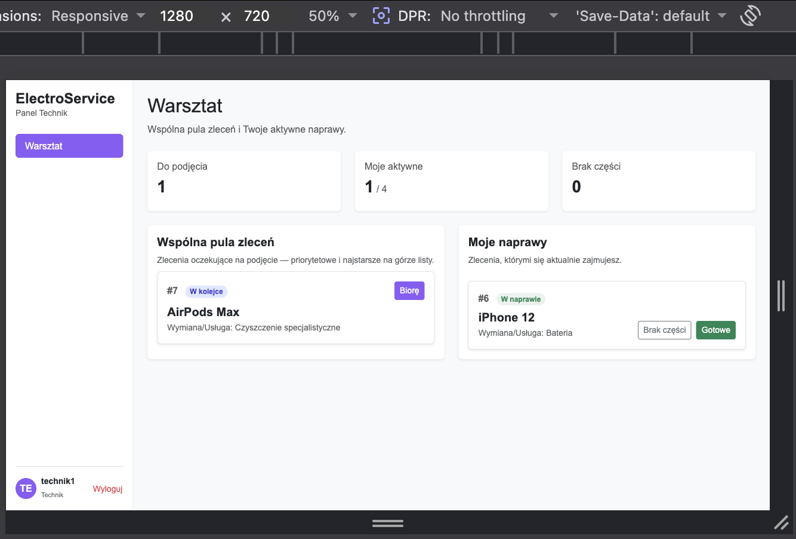
*Rysunek 17. Warsztat technika w widoku 1280x720 - pula zleceń i aktywne naprawy układają się responsywnie, zapewniając wygodną obsługę na tablecie.*

---

### 5. Zaawansowane mechanizmy biznesowe

- **Mechanizm wycofania zlecenia (Odrzucenie kosztów):** Jeśli podczas wydawania sprzętu klient nie zaakceptuje zwiększonych kosztów (wynikających z dodatkowych części zamówionych przez technika), recepcja klika "Odrzuca". Zlecenie natychmiast wraca do TEGO SAMEGO technika jako **priorytet** w celu wymontowania nowej części i przywrócenia stanu pierwotnego.
- **Sieroca Pula:** W przypadku usunięcia konta technika lub zmiany jego roli na inną, wszystkie jego aktywne zlecenia automatycznie tracą przypisanie i wracają do puli głównej (status "W kolejce"), aby inni pracownicy mogli je przejąć.
- **Bezpieczeństwo danych i obrazów:** 
  - Zdjęcia dokumentujące stan sprzętu są **kompresowane w przeglądarce** (JS Canvas) przed wysyłką na serwer, co oszczędza transfer i miejsce na dysku.
  - Hasła pracowników są chronione algorytmem **BCRYPT**.

---

## Plany rozbudowy

**Wersja 2.0:**
- **Moduł Finansowy:** Generowanie faktur PDF (zamiast .txt) oraz integracja z systemami płatności online.
- **Powiadomienia:** Automatyczna wysyłka SMS/E-mail do klienta po zmianie statusu na "Gotowe".
- **Panel Klienta:** Możliwość sprawdzenia statusu online po wpisaniu numeru seryjnego i ID zlecenia (obecnie dostępne tylko z poziomu recepcji).
- **Logi Aktywności:** Rejestrowanie każdej zmiany statusu z informacją, który pracownik jej dokonał.

**Optymalizacja:**
- Migracja bazy danych na PostgreSQL w celu zwiększenia wydajności przy dużym ruchu.
- Wdrożenie cache'owania Redis dla dynamicznego kalendarza dostępności.
- Konteneryzacja (Docker) dla ułatwienia wdrożeń produkcyjnych.

---
*Projekt: System Zarządzania Serwisem Elektroniki*
*Autor: Mateusz Pociecha*

